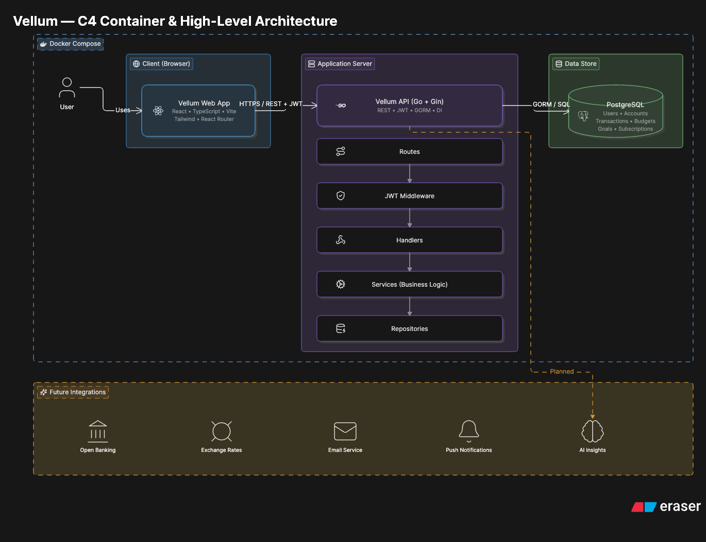

# Vellum

Vellum is a full-stack personal finance and budgeting application for managing
accounts, transactions, budgets, goals, subscriptions, settings, and analytics.

## Quick Links

General:

- [Overview](#overview)
- [Prerequisites](#prerequisites)
- [Architecture](#architecture)
- [Repository Structure](#repository-structure)

Local environment:

- [Quickstart](#quickstart)
- [Accessing the Local Environment](#accessing-the-local-environment)
- [Configuration Variables](#configuration-variables)
- [Development Commands](#development-commands)

Documentation:

- [Backend README](backend/README.md)
- [Architecture Specification](docs/architecture-specification.md)

## Overview

Vellum is organised as a monorepo with three core services:

- **Frontend**: React, TypeScript, Vite, Tailwind CSS
- **Backend**: Go, Gin, GORM, JWT authentication
- **Database**: PostgreSQL

The frontend communicates with the backend over REST APIs. The backend owns all
business logic, authentication, authorization, validation, and persistence.
PostgreSQL is only accessed by the backend.

## Prerequisites

Required:

- Docker
- Docker Compose

Optional for running services outside Docker:

- Go
- Node.js
- pnpm

## Quickstart

Start the full local environment from the repository root:

```bash
docker compose up --build
```

Stop the environment:

```bash
docker compose down
```

Reset the database volume:

```bash
docker compose down -v
```

## Accessing the Local Environment

| Service | URL |
| --- | --- |
| Frontend | `http://localhost:5173` |
| Backend API | `http://localhost:8080` |
| PostgreSQL | `localhost:5432` |

Backend health check:

```http
GET http://localhost:8080/ping
```

## Architecture



The application follows a layered client-server architecture:

```text
Frontend
↓
REST API
↓
Backend
↓
PostgreSQL
```

Backend features follow this layer order:

```text
Model
↓
Repository Interface
↓
GORM Repository
↓
DTOs
↓
Service
↓
Handler
↓
Routes
```

Layer responsibilities:

- **Models** represent database tables.
- **Repositories** communicate with PostgreSQL through GORM.
- **DTOs** define API request and response shapes.
- **Services** contain business logic, validation, and ownership checks.
- **Handlers** parse requests, call services, and return JSON.
- **Routes** connect HTTP endpoints to handlers.
- **Middleware** authenticates requests and places `userID` into request context.

See [docs/architecture-specification.md](docs/architecture-specification.md) for
the full architecture notes.

## Repository Structure

```text
.
├── backend/             # Go API
├── frontend/            # React application
├── docs/                # Architecture documentation
├── docker-compose.yml   # Local service orchestration
└── README.md
```

## Configuration Variables

The backend reads configuration from environment variables. Local environment
files must not be committed.

Required backend variables:

- `PORT`
- `DB_HOST`
- `DB_PORT`
- `DB_USER`
- `DB_PASSWORD`
- `DB_NAME`
- `DB_SSLMODE`
- `JWT_SECRET`
- `JWT_EXPIRY`

Frontend API requests are configured to call the backend at:

```text
http://localhost:8080
```

## Development Commands

Backend:

```bash
cd backend
go fmt ./...
go test ./...
go mod tidy
go run ./cmd/api
```

Frontend:

```bash
cd frontend
pnpm install
pnpm dev
pnpm build
pnpm lint
```

Docker logs:

```bash
docker compose logs -f backend
docker compose logs -f frontend
docker compose logs -f postgres
```

## Core Modules

- Authentication
- Users
- User settings
- Accounts
- Categories
- Transactions
- Budgets
- Goals
- Subscriptions
- Dashboard
- Analytics

## API Documentation

Backend route details live in [backend/README.md](backend/README.md).

The backend uses JWT Bearer authentication for protected endpoints:

```http
Authorization: Bearer <jwt>
```
