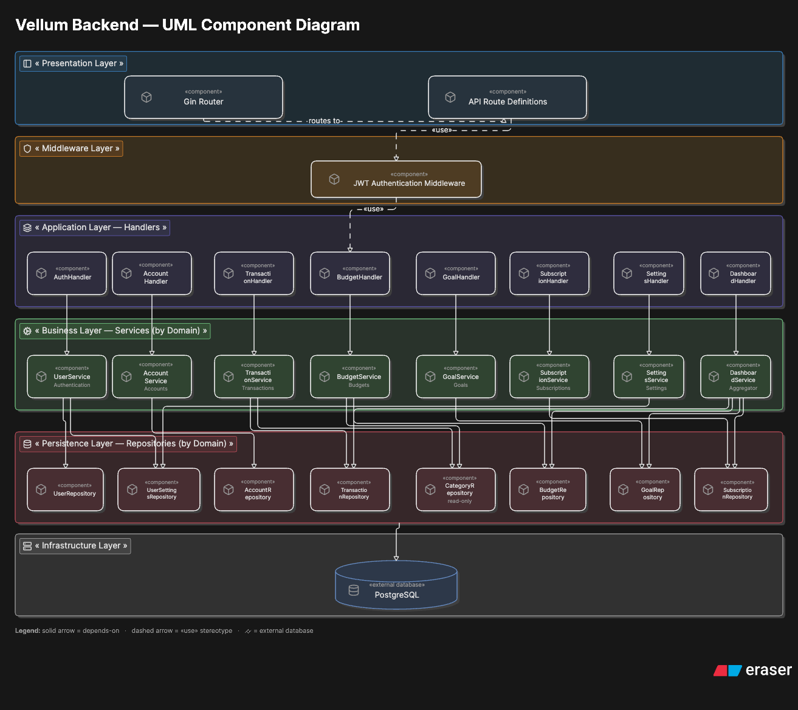
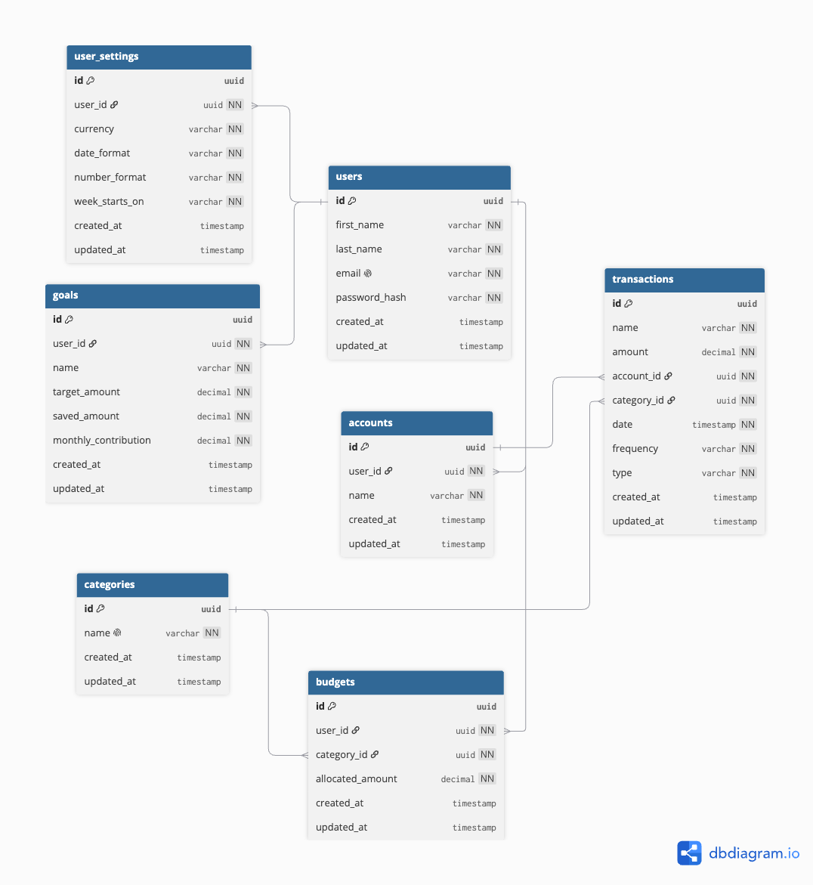

# Vellum Backend

Go API for **Vellum**, a personal budgeting and finance application.

The service uses Gin for HTTP routing, GORM for PostgreSQL persistence, bcrypt
for password hashing, and JWTs for authentication.

## Tech Stack

- Go
- Gin
- GORM
- PostgreSQL
- JWT
- bcrypt
- Docker Compose
- Air

## Architecture



The backend follows a layered structure:

- Routes and middleware handle HTTP entry points and authentication.
- Handlers parse requests and return JSON responses.
- Services contain business logic, validation, and ownership checks.
- Repositories are the only layer that talks to PostgreSQL through GORM.

## Getting Started

From the repository root:

```bash
docker compose up --build
```

The backend runs on:

```text
http://localhost:8080
```

To run the backend directly:

```bash
cd backend
go run ./cmd/api
```

## Configuration

Configuration is loaded from environment variables. Local environment files
should not be committed.

Required variables:

- `PORT`
- `DB_HOST`
- `DB_PORT`
- `DB_USER`
- `DB_PASSWORD`
- `DB_NAME`
- `DB_SSLMODE`
- `JWT_SECRET`
- `JWT_EXPIRY`

`JWT_EXPIRY` uses Go duration format, for example `1h` or `24h`.

## API

### Health Check

```http
GET /ping
```

### Register

```http
POST /register
Content-Type: application/json
```

```json
{
  "FirstName": "Ada",
  "LastName": "Lovelace",
  "Email": "ada@example.com",
  "Password": "<password>"
}
```

Returns:

```json
{
  "access_token": "<jwt>"
}
```

### Login

```http
POST /login
Content-Type: application/json
```

```json
{
  "Email": "ada@example.com",
  "Password": "<password>"
}
```

Returns:

```json
{
  "access_token": "<jwt>"
}
```

## Authentication

Authenticated requests use a Bearer token:

```http
Authorization: Bearer <jwt>
```

The auth middleware validates the token and stores the authenticated user ID in
the Gin context as `userID`.

## Project Structure

```text
cmd/
└── api/              # Application entry point

internal/
├── auth/             # JWT helpers
├── config/           # Environment configuration
├── database/         # Database connection and migrations
├── dto/              # Request and response payloads
├── handlers/         # HTTP handlers
├── middleware/       # Gin middleware
├── models/           # GORM models and enums
├── repositories/     # Data access layer
├── routes/           # Route registration
├── server/           # Application wiring
└── services/         # Business logic
```

## Data Model



The backend defines models for:

- Users
- User settings
- Accounts
- Categories
- Transactions
- Budgets
- Goals

All models embed a shared base model with a UUID primary key and timestamps.
Migrations run automatically on startup through GORM.

## Development

Common commands:

```bash
go fmt ./...
go test ./...
go mod tidy
```

Docker logs:

```bash
docker compose logs -f backend
```

## Roadmap

- Account routes
- Category routes
- Transaction routes
- Budget routes
- Goal routes
- Subscription routes
- User settings routes
- Dashboard and analytics routes
- CSV export
- Request validation
- Test coverage
